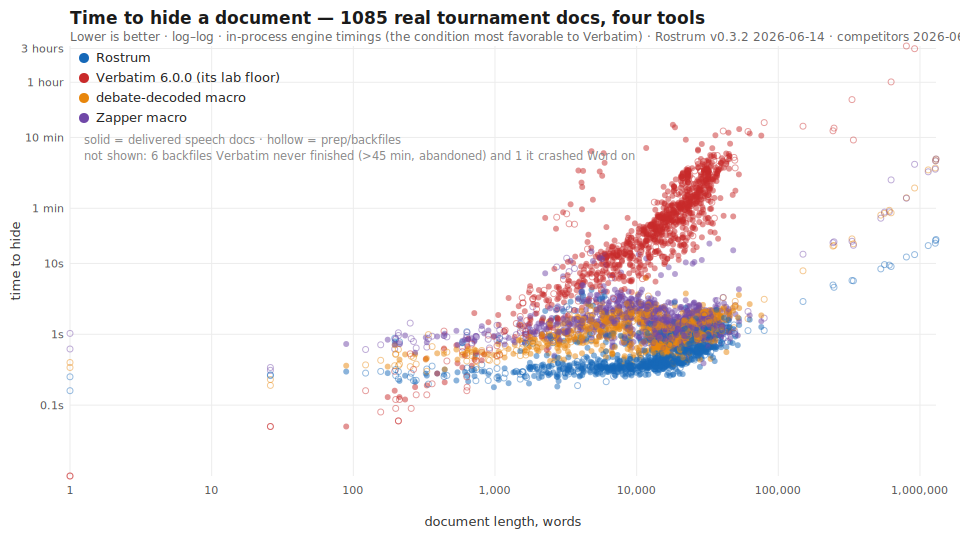
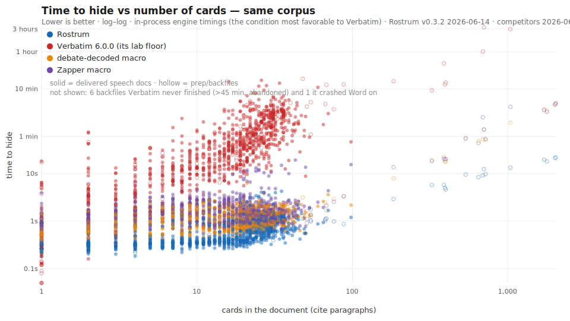

# Rostrum: invisibility &amp; debate formatting for Word and Google Docs

[](https://andrewtjin.github.io/rostrum/)
<!-- The badge reads an anonymous, CROSS-PLATFORM download counter: the Word
     manifest.xml downloads + the Google Docs Code.gs downloads, summed (see
     worker/ and the site's privacy page). "installs" is the promotional label;
     the privacy disclosure describes the same numbers literally as "downloads"
     and notes both biases (Word re-downloads over-count; Google Docs copies that
     carry the bound script under-count), so it's a rough reach figure, not a
     precise tally. /count also exposes the per-surface `word` and `google_docs`. -->

Rostrum collapses a debate doc to a **headings + cites + highlights** view and formats
cards (**reversibly**) in the two editors debaters actually use: **Microsoft Word**
(desktop) and **Google Docs**. Same idea on both surfaces; two separate engines under
the hood.

## Get Rostrum

| Your editor | Install | Status |
|---|---|---|
| **Microsoft Word** (Windows, Mac; Web *on the roadmap*) | **[Install for Word ›](docs/install-word.md)**: register one manifest file, once | live |
| **Google Docs** | **[Install for Google Docs ›](google-docs/README.md)**: paste one script, ~2 min | early (MVP) |

> Two install paths because they're two platforms: in Word you register a hosted
> add-in manifest once and it rides every document; in Google Docs you paste a single
> script into the doc's own Apps Script project. Pick your editor above.

## What Rostrum does (both surfaces)

- **Hide** collapses every body run except the keepers (**headings, cites, and
  highlighted text**) to a dense, skimmable view; **Show All** brings every word back.
- **Reversible without Rostrum.** In Word, hidden text is Word's own *Hidden font*
  attribute (clear it from the Font dialog). In Google Docs, Hide is a font-size shrink
  (**not secrecy**) that anyone undoes with Select All → font size 11.
- **Apply debate styles**: Pocket / Hat / Block / Tag / Normal.
- The keep-set and the "Show All restores everything" contract are identical on both.

> **Two engines, not one.** The Word add-in (`src/`, Office.js over Word's OOXML) and
> the Google Docs port (`google-docs/`, Apps Script over the Docs object model) share **no
> engine code**; each is built for its platform's document model, and they version
> independently. **Every benchmark and competitive claim below is Word-specific**; the
> Google Docs port is an early MVP with no performance corpus of its own (yet).

---

## Microsoft Word add-in

A desktop Word add-in suite for collapsing, condensing, and formatting debate docs in
prep or in-round. **The numbers and comparisons in this section are measured on the
Word engine only.**



**1,085 real tournament documents** (two seasons' worth of speech docs plus giant backfiles),
each hidden by all four tools on the market, engine-to-engine:

| | **Rostrum** | Verbatim 6.0.0¹ |
| --- | --- | --- |
| Median hide, delivered speech docs | **~1 s** | ~35 s (**~31× slower** doc-for-doc) |
| Worst speech doc | 11 s | 6 docs never finished (15-min cap) |
| 0.9–1.3M-word backfiles | **36–59 s** | 1–3 **hours**; 6 more abandoned at 45 min; 1 crashed Word |
| Completed the corpus | **1,085 / 1,085** | 1,055 / 1,085 (timeouts, a Word crash, 17 files its macro errors out on) |

¹ Verbatim timed at its in-process *lab floor*, the most favorable condition it has;
as actually experienced (ribbon click, foreground window) it measures 2–6× slower
than these numbers.

The destructive community "zap" macros match Rostrum's speed on small docs but fall
~10× behind on backfiles, and they permanently delete what they hide, where Rostrum's
hide is lossless and reversible. Full per-doc dataset, methodology, and the cards-vs-time
chart: [how it compares](https://andrewtjin.github.io/rostrum/comparison.html).



> **Status: v0.3.1.0, live.** Two tools (Invisibility Mode and Condense & Shrink)
> alongside a Settings pane. The production build is hosted on GitHub Pages; install
> instructions below.

> **Desktop only.** Rostrum hides text with Word's *Hidden font* attribute
> (`<w:vanish/>`), which is `WordApiDesktop 1.2`, present on Word for Windows and Mac,
> absent on Word for the web and Office 2016–2021 perpetual. On an unsupported host the
> pane explains the manual fallback instead of failing silently.

---

### Install &amp; develop

Debaters install from the hosted page in one step (register one `manifest.xml` in Word,
once); developers run it locally over the HTTPS dev server. The full Windows/Mac sideload,
the developer flow, the requirements floor, and how the production manifest is generated
all live in one place:

> **[Install for Word ›](docs/install-word.md)**

---

## The suite

Everything lives on a single Rostrum ribbon tab. Each tool is its own ribbon group with a
deep-linked pane; the suite is generated from one feature registry, so adding a tool is
"register it + regenerate the manifest."

| Group (left → right) | Status | What it is |
|---|---|---|
| **Settings** | live | App-wide settings: an informational pane (gear icon, leftmost) covering how Rostrum loads on every document (the Trusted-Catalog install) and where to turn that off (the host's Trust Center). Contributes no document-mutating commands. |
| **Invisibility** | live | Hide card bodies to a headings/cites/highlights-only view; natively reversible. |
| **Condense** | live | Shrink card font size and condense paragraph spacing; losslessly reversible. |

More tools are on the roadmap (Format & Condense, Flow, Cite & Paste); they'll be added to
the ribbon as they're built. Adding one is "register it + regenerate the manifest"; the
registry-driven shell, ribbon, and dialog don't otherwise move.

---

## Why Rostrum, not a macro

Verbatim and the other in-round tools are VBA `.dotm` **macros**; Rostrum is a modern
**Office.js add-in**. The architecture gap shows up where it matters; each advantage
links to where Rostrum proves it.

| Advantage | Proof |
|---|---|
| **Keep working in your other docs while a document hides.** Rostrum runs async in its own process, so a Hide never freezes Word the way a UI-thread macro does: start one on a huge file and keep reading, editing, or prepping elsewhere. | [Non-blocking ›](#non-blocking-keep-working-while-a-doc-hides) |
| **Reversible without the add-in.** Hidden text is Word's own *Hidden font* attribute, so any reader clears it from the Font dialog. No Rostrum, no template required. | [Reversibility ›](#reversibility-without-the-add-in) |
| **Lossless Shrink & Condense.** Unshrink/Uncondense rebuild the original from self-describing markers in the document, with no sidecar file. | [Condense & Shrink ›](#condense--shrink) |
| **The same view re-derives on every machine.** The on-state and keep-colors ride inside the file as one custom XML part: no per-span tracking, survives format round-trips. | [Invisibility Mode ›](#invisibility-mode) |
| **Always shows highlighted text.** Partial-keep is preserved down to the run; Rostrum never blunt-hides a whole card. | [Invisibility Mode ›](#invisibility-mode) |

---

## Invisibility Mode

| Action | Effect |
|--------|--------|
| **Hide** | Hides every non-keeper body run (and collapses fully-hidden paragraphs), then *arms* the document. Keeps: paragraphs at outline level 0–3 (Heading 1–4 + the navy Analytics style), any paragraph containing a cite-styled run, and runs highlighted in a keep-color (only the highlighted runs; a partial highlight does not drag the rest of the word visible). Safe to re-run: press it again after editing to re-derive over the whole document and catch newly typed or pasted text (there is no separate "Re-hide" button). |
| **Show All** | Reveals everything Rostrum hid and disarms. Safe to run from any partial state. |
| **Apply Styles** | *(gated)* Sets the template's heading/cite sizes, boxes the Pocket, and repairs mis-styled cites. Reflows the document; needs desktop Word 1.5+ and is reversible only with Ctrl+Z. |
| **Options** | The deep-linked pane: keep-color settings, whole-body commit mode, and the Diagnostics console (below). |

The ON-state + keep-colors live in a single document-level custom XML part (the
"manifest"), so any machine that opens the file re-derives the same view: no per-span
tracking, and it survives format round-trips.

---

## Condense & Shrink

A lossless equivalent of Verbatim's Shrink and Condense. The ribbon surfaces four direct
verbs plus an Options pane (mode checkboxes, one-click mode buttons, a live shrink-size
readout, and the omission-marker editor).

| Action | Effect |
|--------|--------|
| **Shrink** | Cycles the selected card's non-underlined text down a font size (8→7→6→5→4→Normal), keeping the underlined cut, highlights, cites, and headings full-size. Press again to shrink further. |
| **Condense** | Collapses the selection per your Condense settings (merge paragraphs / pilcrows / retain paragraphs). |
| **Uncondense** | Reverses Condense, restoring every paragraph break Rostrum marked. |
| **Unshrink** | Reverses Shrink, resetting the selected card's text back to its Normal size. |
| **Options** | Modes, the omission-marker editor, and one-click mode buttons. |

Reversal is lossless and add-in-free: the self-describing OOXML markers Condense writes
(no sidecar) let Uncondense/Unshrink reconstruct the original from the document itself.
Needs only the core OOXML round-trip, so it runs wherever the suite loads.

---

## Reversibility (without the add-in)

Invisibility Mode hides text with the Hidden font attribute, the same one Word's own Font
dialog writes. So a recipient who *doesn't have the add-in* can still recover everything:

1. Select the text (Ctrl+A for the whole document).
2. **Home ▸ Font dialog (Ctrl+D) ▸ clear the _Hidden_ checkbox**, or toggle
   **Home ▸ ¶ (Show/Hide)** to view hidden text.

Caveat, the **"Show hidden text" display setting:** if a reader has *File ▸ Options ▸ Display
▸ Hidden text* enabled, hidden runs render (greyed/dotted-underlined) rather than
disappearing. That's a viewer preference, not a Rostrum bug; Show All still removes the
hiding.

Condense & Shrink are likewise reversible from the document alone (Uncondense / Unshrink),
via the self-describing markers Condense writes.

---

## How Rostrum compares to the macros

The headline advantages are up top; this is the evidence behind them. Two of those
advantages have their own sections, [Reversibility](#reversibility-without-the-add-in)
and [Condense & Shrink](#condense--shrink), and the one that's pure architecture, the one
a macro can't match, is spelled out here.

### Non-blocking: keep working while a doc hides

Verbatim and the other debate tools are VBA `.dotm` **macros**: they run *synchronously on
Word's own UI thread*, so while one churns through a long file the entire application is
frozen, so you can't scroll, type, or switch documents until it finishes. Rostrum's
Invisibility is an **Office.js add-in running in a separate process**, so a Hide never
locks the host. Kick off a Hide on a 900k-word case file and you can immediately switch to
your *other* open documents and keep reading, editing, and prepping while it runs; you can
even start Rostrum on a second document. That's a genuine **multi-doc, in-round workflow** a
macro architecturally cannot offer.

### Function by function

Each Rostrum tool against the Verbatim 6.0.0 macro it replaces, including the small
behavioral differences that only show up on a real card. (All Verbatim behavior below is
read from its `View.bas` / `Condense.bas` / `Shrink.bas` source.)

**Invisibility Mode (Hide / Show All).** Both tools hide everything that isn't a tag, cite,
or highlight using Word's native **Hidden font** attribute, and both reverse from the Font
dialog without the tool, so reversibility is a wash. What differs is *how the hidden page
reads*:

| | Rostrum | Verbatim 6.0.0 |
|---|---|---|
| What it hides | The whole non-kept **run** (`<w:vanish/>`) | Each non-space **character** that isn't highlighted (a `[! ]` find/replace sets `Font.Hidden`) |
| The space hidden text used to occupy | Collapses: only a single separator space is re-exposed where two kept chunks would fuse, so the survivors **close up to the left** into a dense, straight column | Stays: the find pattern excludes spaces, so every inter-word space remains visible and kept fragments float at their **original positions** with ragged gaps |
| A fully-hidden line | Its paragraph mark is hidden too, so the line **collapses** with no blank row | Paragraph marks are never hidden, so fully-hidden lines remain as **blank rows** |
| While it runs | Async in a separate process, so Word stays responsive | A synchronous loop on Word's UI thread (no `ScreenUpdating` suppression), so Word **freezes** until a long file finishes |
| Re-running after edits | Idempotent + convergent: press Hide again to re-derive over the whole doc and catch new text | A plain on/off toggle; turning it off reveals **all** hidden text, including anything you hid yourself |

The left-aligned look isn't a hard-coded alignment. Because Rostrum removes the runs
themselves (and the empty paragraphs around them) rather than just the visible glyphs, the
kept text simply *reflows* once everything to the left of each highlight is gone.

**Shrink.** Rostrum keeps the underlined cut **plus** highlights, cites, and headings
full-size and steps 8 → 7 → 6 → 5 → 4 → Normal; Verbatim keys on **underline only** and
steps 11 → 8 → 7 → 6 → 5 → 4 before cycling. Both reverse to the Normal style size.

**Condense.** Rostrum is **always** reversible from the document alone (Uncondense rebuilds
from self-describing OOXML markers, with nothing shown in the text). Verbatim is reversible only
in pilcrow mode, which inserts literal `¶` characters; its default merges paragraphs
**one-way** (the original break types are lost).

> The public [comparison page](https://andrewtjin.github.io/rostrum/comparison.html)
> frames these tool by tool as plain-English advantages.

---

## Caveats

- **Co-authoring:** there's no reliable Office.js signal for a live co-authoring session.
  Hiding/showing while others edit may merge unpredictably; Show All is convergent, but run
  invisibility when you're the sole editor. The pane warns when armed.
- **Track Changes:** Hide refuses to run while Track Changes is on (a partial Undo could
  otherwise strand the document). The pane offers to toggle it off for the operation and
  restore it after.
- **Apply Styles** reflows pagination and is **not** undone by Show All; use Ctrl+Z. The
  pocket box needs `Style.borders` (desktop); the per-paragraph `w:pBdr` fallback is
  documented but not auto-applied.

---

## Google Docs port

Rostrum's **Invisibility Mode** and **debate styles** in a Google Doc, paste-in, no
Marketplace. An early **v0.1.0 MVP**: Hide / Show All, Apply debate styles, and Mark cite,
driven from a **Rostrum** menu. Full install + usage:
**[Install for Google Docs ›](google-docs/README.md)**.

- **What Hide does.** Hide here reduces body text to a 1‑point size (the Docs object
  model has no hidden-font attribute to borrow), so a long file reads like a speech doc
  and the page count collapses. It is **not secrecy**: Select All → font size 11 reveals
  everything. **Show All** brings every word back. This mirrors how Rostrum behaves in Word.
- **No tracking inside Google Docs.** The pasted script only ever changes font size and
  named‑style definitions; it sends nothing back as you use it. (The single anonymous count
  is the one‑time `Code.gs` download from the site; see [Privacy](https://andrewtjin.github.io/rostrum/privacy.html).)
- **Separate engine, separate code.** Lives in [`google-docs/`](google-docs/) (Apps Script over the
  Docs object model), built into one pasteable `Code.gs` by `npm run build:gdocs`. It
  imports nothing from the Word `src/` engine and versions independently. Its own
  architecture and limits are documented in [`google-docs/README.md`](google-docs/README.md).

---

> **The rest of this README is developer internals**: the engine architecture, the
> in-host debugger, and the test setup. End users need only the sections above.

---

## Architecture

```
src/
├─ core/                      # the engine: PURE, Office.js-free, unit-tested
│  ├─ types.ts                #   WordPort contract + domain model
│  ├─ ooxml.ts                #   per-paragraph <w:vanish/> transforms
│  ├─ keepers.ts invisibility.ts manifest.ts settings.ts styles.ts guards.ts
│  ├─ condense.ts shrink.ts ooxmlCondense.ts   #   Condense & Shrink engine + markers
│  ├─ citeRepair.ts outline.ts progress.ts     #   cite repair, outline normalization, progress
│  ├─ debug.ts                #   the tracer (host-free, tested)
│  ├─ ooxmlPackage.ts         #   PURE whole-body split/splice + outline normalization
│  ├─ officeWordPort.ts       #   the REAL WordPort over Word.run  ← the only deep Office.js
│  └─ officeStyles.ts         #   ensureRostrumStyles (host glue + pure plan)
├─ features/                  # the SUITE registry: one headless contribution per tool
│  ├─ contributions.ts registry.ts types.ts    #   the single feature list + ribbon descriptors
│  ├─ ribbonRuntime.ts manifestGen.ts          #   shared in-flight guard / progress + manifest gen
│  ├─ invisibility/ condense/ settings/         #   live tools (contribution + pane)
│  └─ planned.ts              #   roadmap tools, advertised on the ribbon as data
├─ taskpane/                  # React shells over the controllers
│  ├─ controller.ts condenseController.ts        #   UI orchestration, TESTED
│  ├─ App.tsx Shell.tsx components/ host.tsx
│  └─ index.tsx taskpane.html
├─ commands/                  # ribbon handlers (reuse the controllers)
└─ dialog/                    # the full-window workspace surface (planned dialog tools)
```

The design principle (from Stage 1) holds: pure policy behind a narrow port. The engine
reasons about paragraphs as `(outline level, OOXML string)` and never touches Word; one
adapter (`officeWordPort.ts`) turns that into `Word.run` calls. The engine, adapter
sequencing, and UI orchestration are all tested in plain Node with a fake host: no Office
mock, no browser. `npm test` → **469 tests**.

### Commit strategy (and the Step-0 fidelity spike)

The adapter supports two write mechanisms:

- **`per-paragraph`** *(default)*: read and write each paragraph through its own range.
  Index alignment is exact; no whole-document re-serialization.
- **`whole-body`** *(opt-in)*: one `body.getOoxml()` → splice only `<w:vanish/>` → one
  `body.insertOoxml("Replace")`. Fewer host round-trips at 200–300 pages, but its
  correctness depends on (a) xmldom re-serializing the whole body acceptably to Word and
  (b) the `<w:p>` document order aligning with `body.paragraphs`. Both need a live-host
  fidelity spike that can't run headless, so it is opt-in and carries a structural
  alignment guard that auto-falls-back to per-paragraph on any count mismatch (logged).

To run the spike: build a throwaway doc with a TOC, section breaks, headers/footers,
tables, numbered lists, and fields; flip one run's visibility via `whole-body`; verify
numbering/sections/headers/fields/bookmarks/TOC are intact. If clean, flip the default
(`createOfficeWordPort({ commitStrategy: "whole-body" })`). The in-process perf test shows
whole-body's xmldom cost is real (≈9× the per-paragraph JS time on 5,000 paragraphs), so
per-paragraph is also the better default until the spike justifies the switch.

---

## Debugging

You cannot attach a normal debugger inside a live Word host, so Rostrum ships its own
diagnostics. Open the **Diagnostics** section at the bottom of the Invisibility pane:

- **Capability matrix**: exactly which Office.js requirement sets this host advertises
  (and therefore which features are on).
- **Manifest state**: armed yes/no, and the active keep-colors.
- **Log level**: `debug / info / warn / error`, persisted across reloads.
- **Live log**: every host round-trip is a timed tracer event tagged with an operation
  id, so you can follow one user action end-to-end (e.g.
  `adapter hide#3 | ✔ writeManifest (+812ms)`).
- **Copy bug report**: bundles the whole recent timeline + host/UA + capability matrix to
  the clipboard. Paste it into an issue and the failure is fully reproduced in text.

Under the hood (`src/core/debug.ts`): a ring-buffered tracer with pluggable sinks, payload
clamping (a 200-page OOXML string can't OOM the buffer), and `OfficeExtension.Error`
expansion (`.code` / `.debugInfo.errorLocation` are captured, not just the generic
`.message`). Every adapter/styles/ribbon failure flows through it, and the same lines
mirror to the browser console.

---

## Testing

```bash
npm test           # 469 unit + integration tests (Node, no host)
npm run typecheck  # tsc --noEmit
npm run build      # production webpack bundle
```

Adapter/integration tests run the real engine through a fake `Word.RequestContext`
(`__tests__/fakeWord.ts`) that models Office.js's queue-then-`sync()` semantics, so they
assert the hard invariants directly: single-sync atomic commit, manifest set-vs-add, the
Track-Changes restore error, the multi-`<w:p>` guard, outline normalization, the
whole-body alignment fallback, and Condense/Shrink round-trip losslessness.
